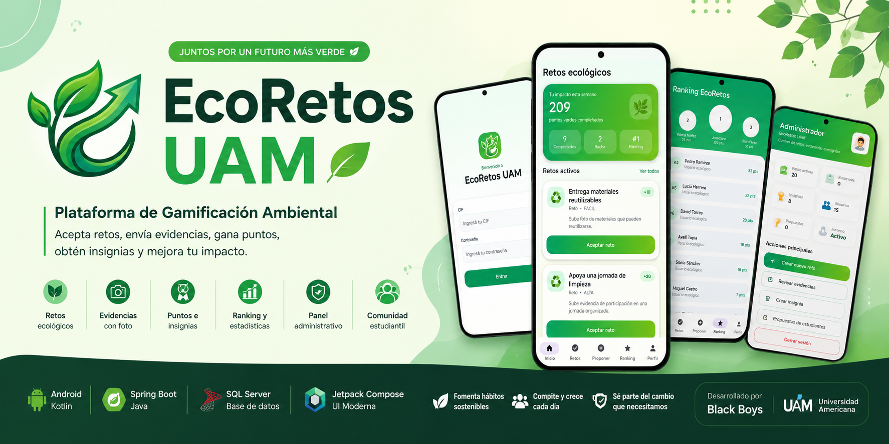
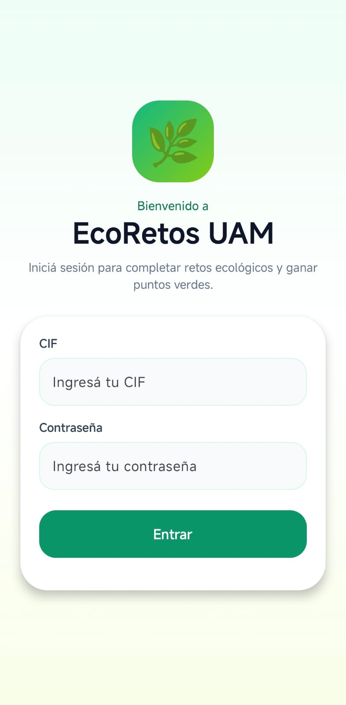
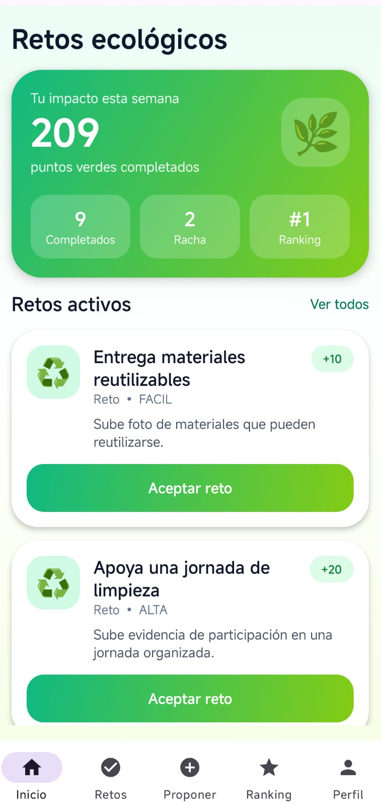
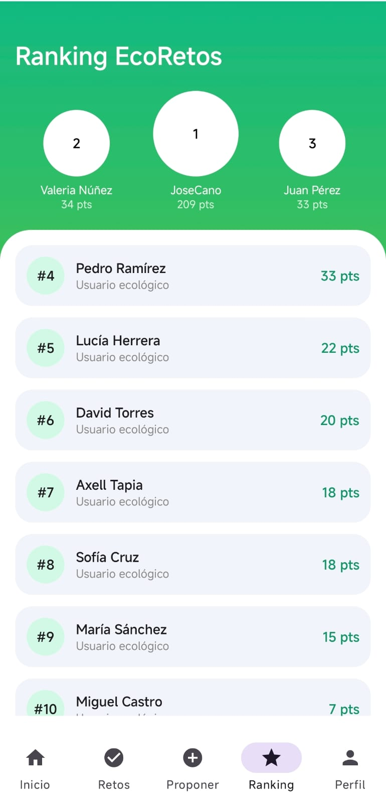
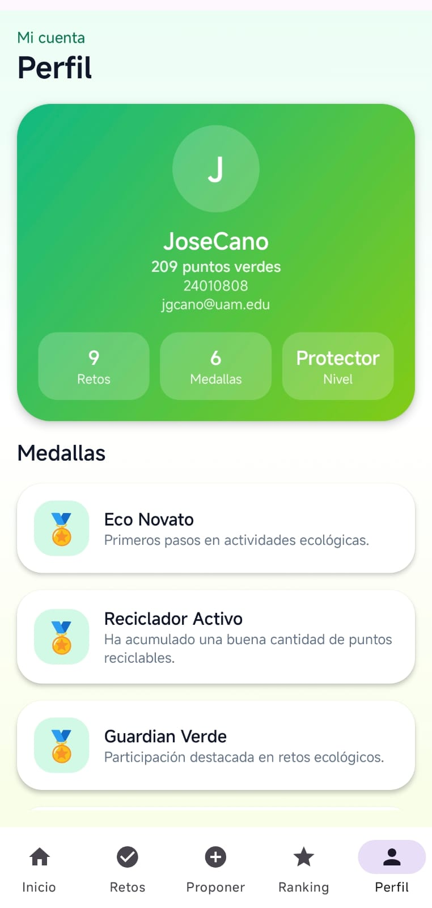
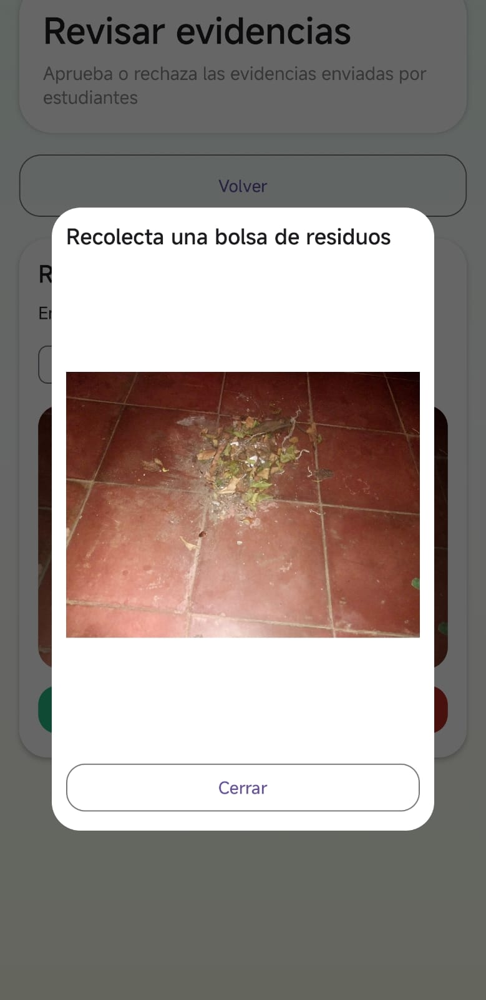
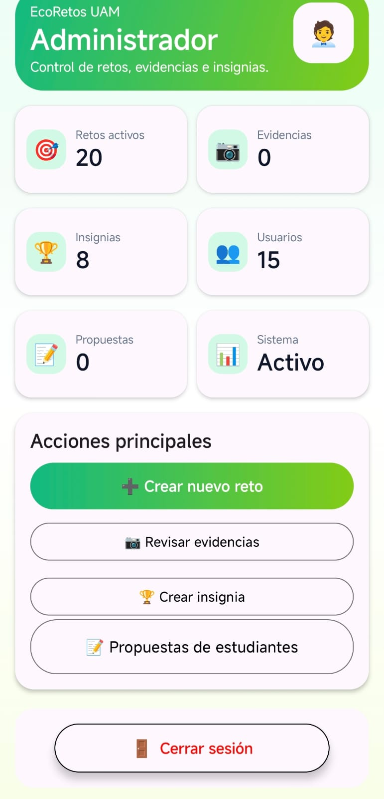

<div align="center">



# 🌱 EcoRetos UAM

### Plataforma de Gamificación Ambiental

Transformando acciones ecológicas en **retos**, **puntos**, **insignias** e **impacto positivo** dentro de la comunidad universitaria.

<br>


---

### 👨‍💻 Desarrollado por **Black Boys**

Universidad Americana (UAM)

</div>

---

# 📖 Descripción

EcoRetos UAM es una plataforma compuesta por una aplicación móvil Android desarrollada con **Jetpack Compose** y una **API REST implementada con Spring Boot**, diseñada para incentivar la participación de los estudiantes en actividades ecológicas mediante un sistema de gamificación.

La plataforma permite aceptar retos ambientales, registrar evidencias fotográficas, acumular puntos, desbloquear insignias y competir dentro de un ranking institucional.

Por otra parte, los administradores cuentan con un panel completo para gestionar retos, revisar evidencias, aprobar propuestas realizadas por estudiantes y administrar las insignias del sistema.

El propósito principal de EcoRetos es fomentar hábitos sostenibles dentro de la comunidad universitaria mediante una experiencia tecnológica moderna, intuitiva y motivadora.

---

# 🌍 ¿Por qué EcoRetos?

<table>
<tr>

<td align="center">

### 🌱 Promueve hábitos sostenibles

Motiva a los estudiantes a participar activamente en actividades ecológicas que generan un impacto positivo dentro del campus universitario.

</td>

<td align="center">

### 🏆 Gamificación

Cada reto completado genera puntos, permite desbloquear insignias y mejora la posición del estudiante dentro del ranking.

</td>

</tr>

<tr>

<td align="center">

### 📷 Evidencias fotográficas

Las actividades realizadas son verificadas mediante evidencias enviadas desde la aplicación móvil.

</td>

<td align="center">

### 👨‍💼 Administración centralizada

Los administradores gestionan todo el sistema desde un único panel con estadísticas y herramientas de control.

</td>

</tr>

</table>

---

# 🎯 Objetivos

## Objetivo General

Desarrollar una plataforma tecnológica que incentive la participación ambiental mediante retos ecológicos, recompensas y estadísticas de impacto.

---

## Objetivos Específicos

- Promover hábitos ecológicos dentro de la universidad.
- Digitalizar la gestión de retos ambientales.
- Incentivar la participación mediante gamificación.
- Centralizar la administración de retos y evidencias.
- Implementar un sistema de puntos, insignias y ranking.
- Facilitar la creación colaborativa de nuevos retos.

---

# ✨ Características destacadas

| Característica | Disponible |
|---------------|:----------:|
| 🌱 Retos ecológicos | ✅ |
| 📷 Evidencias fotográficas | ✅ |
| 🏆 Sistema de puntos | ✅ |
| 🎖 Insignias automáticas | ✅ |
| 📈 Ranking en tiempo real | ✅ |
| 👤 Perfil personalizado | ✅ |
| 💡 Propuestas de retos | ✅ |
| 👨‍💼 Dashboard administrativo | ✅ |
| 📊 Estadísticas de impacto | ✅ |
| 🔒 Gestión por roles | ✅ |

---

# 👨‍🎓 Funcionalidades del Estudiante

- 🔐 Inicio de sesión.
- 🌱 Visualización de retos disponibles.
- ✅ Aceptar retos.
- ❌ Cancelar retos aceptados.
- 📷 Enviar evidencias fotográficas.
- 💡 Proponer nuevos retos.
- 🏆 Consultar ranking.
- 👤 Visualizar perfil.
- 📈 Consultar impacto ambiental.
- 🎖 Desbloquear insignias automáticamente.

---

# 👨‍💼 Funcionalidades del Administrador

- 📊 Dashboard administrativo.
- ➕ Crear retos.
- ✏ Editar retos.
- 🚫 Desactivar retos.
- 📷 Revisar evidencias.
- 🔍 Ampliar imágenes de evidencias.
- ✅ Aprobar evidencias.
- ❌ Rechazar evidencias.
- 🏅 Crear insignias.
- 💡 Revisar propuestas.
- 🌱 Aprobar propuestas de estudiantes.

---

# 🛠 Tecnologías utilizadas

| Frontend | Backend | Base de Datos |
|----------|----------|---------------|
| Kotlin | Java | SQL Server |
| Jetpack Compose | Spring Boot | SQL Server 2022 |
| Material Design 3 | Spring Data JPA | T-SQL |
| MVVM | REST API | |

---

# 📱 Vista previa de la aplicación

<div align="center">

Una mirada rápida a las pantallas principales de **EcoRetos UAM**, tanto para estudiantes como para administradores.

---

## 🔐 Acceso al sistema

<table>
<tr>
<td align="center" width="50%">

### Inicio de sesión



Acceso según rol: estudiante o administrador.

</td>
<td align="center" width="50%">

### Inicio del estudiante



Resumen de retos, puntos, racha e impacto personal.

</td>
</tr>
</table>

---

## 👨‍🎓 Experiencia del estudiante

<table>
<tr>
<td align="center" width="33%">

### Ranking



Clasificación de estudiantes por puntos acumulados.

</td>
<td align="center" width="33%">

### Perfil



Datos personales, nivel ecológico e insignias.

</td>
<td align="center" width="33%">

### Evidencias



Visualización y revisión de evidencias enviadas.

</td>
</tr>
</table>

---

## 👨‍💼 Panel administrativo

<table>
<tr>
<td align="center" width="100%">

### Dashboard del administrador



Panel con estadísticas reales, accesos rápidos y gestión del sistema.

</td>
</tr>
</table>

</div>

---

# 🚀 Instalación

## Clonar el repositorio

```bash
git clone https://github.com/TU_USUARIO/EcoRetos-app.git

git clone https://github.com/TU_USUARIO/EcoRetos-api.git
```

---

## Backend

1. Abrir el proyecto en IntelliJ IDEA.
2. Configurar la conexión con SQL Server.
3. Ejecutar la aplicación Spring Boot.

---

## Android

1. Abrir el proyecto en Android Studio.
2. Configurar la IP de la API en `RetrofitClient.kt`.
3. Ejecutar la aplicación en un dispositivo físico o emulador.

---

# 👥 Roles del Sistema

## 👨‍🎓 Estudiante

El estudiante participa activamente en los retos ecológicos, registra evidencias, propone nuevas actividades, acumula puntos y obtiene insignias conforme avanza dentro de la plataforma.

---

## 👨‍💼 Administrador

El administrador es responsable de gestionar el funcionamiento general del sistema, incluyendo la creación de retos, validación de evidencias, administración de insignias y revisión de propuestas realizadas por los estudiantes.

---

# 👨‍💻 Equipo de Desarrollo

<div align="center">

## **Black Boys**

</div>

| Integrante | Rol |
|------------|-----|
| José Cano | Backend / Android |
| Freddy Peralta | Android |
| Axell Castillo | Android |
| Marcos Lagos | Backend |

---

<div align="center">

## 🌱 EcoRetos UAM

### Construyendo un campus más sostenible mediante tecnología.


</div>
